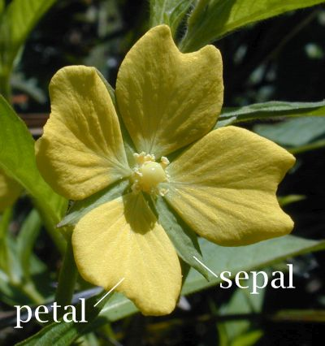

# k-Nearest Neighbors Classification Exercise

Today we will get to know the package `scikit-learn` (sklearn). It has many different machine learning algorithms already implemented. The first algorithm, which we are going to learn today is the k-nearest neighbor algorithm. It can be used for classification as well as for regression.

Take a look at the file `src/nn_iris.py`. We will implement the TODOs step by step:

### Task 1: Loading the data

1. Install the `scikit-learn` package with
   ```bash
   pip install -r requirements.txt
   ```  
   or directly via `pip install scikit-learn`.  
   The dataset <em>iris</em> is very popular amongst machine learners in example tasks. For this reason it can be found directly in the sklearn package.

2. Navigate to the `__main__` function of `src/nn_iris.py`. At first we load the iris dataset from `sklearn.datasets`.  
   In the dataset there are several plants of different species of genus Iris. For each of the examples width and length of petal and sepal of the flower were measured.  
   

3. Find out how to access the attributes of the database (Hint: set a breakpoint and examine the variable). Print the shape of the data matrix and the number of the target entries. Print the names of the labels. Print the names of the features.

### Task 2: Training

Your goal is to determine the species for an example, based on the dimensions of its petals and sepals. 
First, we need to split the dataset into train and test data. Then we are ready to train the model.

1. Use `train_test_split` from `sklearn.model_selection` and create a train and a test set with the ratio 75:25. Print the dimensions of the train and the test set. You can use the parameter `random_state` to set the seed for the random number generator. That will make your results reproducible. Set this value to 29.

2. Define a classifier `knn` from the class `KNeighborsClassifier` and set the hyperparameter `n_neighbors` value to 1.

3. Train the classifier on the training set. The method `fit()` is present in all the estimators of the package `scikit-learn`.

### Task 3: Prediction and Evalutation

The trained model is now able to receive the input data and produce predictions of the labels.
1. Predict the labels first for the train and then for the test data. 

2. The comparison of a predicted and the true label can tell us valuable information about how well our model performs. The simplest performance measure is the ratio of correct predictions to all predictions, called accuracy. Implement a function `compute_accuracy` to calculate the accuracy of predictions. Use your function and evaluate your model by calculating the accuracy on the train set and the test set. Print both results.

### Task 4: Confusion matrix

Another common method to evaluate the performance of a classifier is constructing a confusion matrix that shows not only accuracies for each of the classes (labels), but what classes the classifier is most confused about.

1. Use the function `confusion_matrix` to compute the confusion matrix for the test set.

2. We can also visualize the confusion matrix in form of a heatmap. Use `ConfusionMatrixDisplay` to plot a heatmap of the confusion matrix for the test set. Use `display_labels=iris.target_names` for better visualization.

### Task 5: Hyperparameter tuning

Now we need to find the best value for our hyperparameter `k`. We will use a common procedure called <em>grid search</em> to search the space of the possible values. Since our train dataset is small, we will perform cross-validation in order to compute the validation error for each value of `k`. Implement this hyperparameter tuning in the function `cv_knearest_classifier` following these steps:

1. Define a second classifier `knn2`. Define a grid of parameter values for `k` from 1 to 25 (Hint: `numpy.arange`). This grid must be stored in a dictionary with `n_neighbors` as the key in order to use `GridSearchCV` with it.

2. Use the class `GridSearchCV` to perform grid search. It gives you the possibility to perform n-fold cross-validation too, so use the attribute `cv` to set the number of folds to 3. When everything is set, you can train your `knn2`.

### Task 6: Testing

After the training you can access the best parameter `best_params_`, the corresponding validation accuracy `best_score_` and the corresponding estimator `best_estimator_`.

1. Use the best estimator to compute the accuracy on your train and test sets. Print the results. Has the test accuracy improved after the hyperparameter tuning?

2. Plot the new confusion matrix for the test set.


## k-Nearest Neighbors Regression Exercise (Optional)

Navigate to the `__main__` function of `nn_regression.py` in the `src` directory and fill in the blanks by implementing the TODOs.
